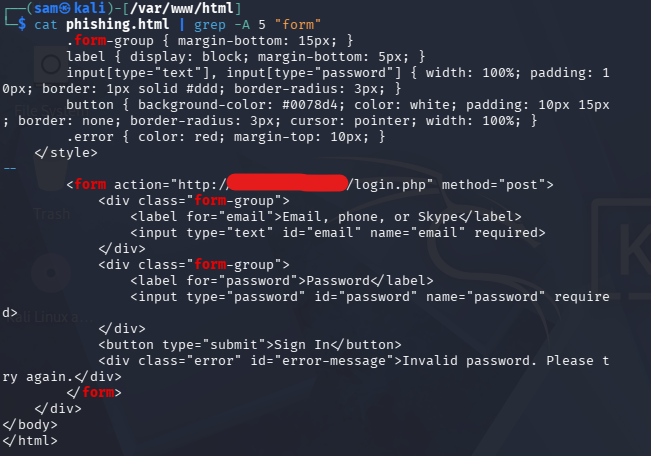

# BEC Attack Simulation

## Overview

This lab demonstrates a Business Email Compromise (BEC)-related credential phishing scenario using Kali Linux as the attacker system and Windows 11 as the victim endpoint.

The objective was to simulate how a user could be directed to a fraudulent Microsoft 365 login page, submit test credentials, and unknowingly transmit those credentials to an attacker-controlled web server.

The initial browser-based attack simulation was completed successfully. Email-based delivery, endpoint monitoring, and post-exploitation activities remain outside the scope of this initial test.

## Lab Environment

- **Attacker:** Kali Linux VM
- **Victim:** Windows 11 VM
- **Network:** VMware NAT
- **Web Server:** Apache2
- **Server-Side Processing:** PHP
- **Monitoring Platform:** Wazuh (integration planned)

All activity was conducted within a controlled virtual lab using test credentials.

## Attack Chain

1. **Reconnaissance:** Prepared the simulated target environment.
2. **Lure Development:** Created a Microsoft 365-themed login page.
3. **Infrastructure Setup:** Configured Apache2 and a PHP handler to receive form submissions.
4. **Delivery:** Accessed the phishing page directly from the Windows VM browser for testing.
5. **Victim Interaction:** Entered test credentials into the simulated login form.
6. **Credential Capture:** Submitted the credentials through HTTP POST to `login.php`.
7. **Redirect:** Redirected the browser to a legitimate Microsoft website after submission.
8. **Post-Exploitation:** Not performed.

## Phishing Infrastructure

### Phishing Page

The simulated login page was hosted on Kali Linux using Apache2.

- **File Location:** `/var/www/html/phishing.html`
- **Web Server:** Apache2
- **Form Fields:** Email and password
- **Submission Method:** HTTP POST
- **Form Handler:** `login.php`

The page used Microsoft 365 branding and a simplified login interface to demonstrate how a familiar-looking authentication page could be used in a phishing scenario.

### Form Submission

The HTML form was configured to submit the entered information to the PHP handler running on the Kali Linux server.

The following screenshot documents the form configuration.

### Credential Capture

The server-side PHP script processed incoming HTTP POST requests and recorded submitted test data.

The script also recorded information useful for investigating the simulated request, including:

- Submitted email address
- Submitted password
- Source IP address
- Browser user-agent
- Timestamp

### Credential Storage

The submitted test data was stored in a local text file named `stolen.txt`.

- **File Location:** `/var/www/html/stolen.txt`
- **Purpose:** Demonstrate server-side capture of submitted test credentials
- **Initial State:** Empty
- **Test Result:** Successfully recorded a simulated credential submission

The following screenshot shows the file before the test.

The next screenshot shows the captured test information after submission.

## Attack Execution

### Step 1: Access the Phishing Page

The phishing page was accessed from the Windows 11 victim VM using its web browser.

This confirmed that the Windows VM could communicate with the Apache2 server hosted on Kali Linux.

### Step 2: Submit Test Credentials

Test credentials were entered into the simulated Microsoft 365 login form.

The browser submitted the information to the PHP handler using an HTTP POST request.

### Step 3: Verify Credential Capture

The captured information was verified on the Kali Linux server by examining the output stored in `stolen.txt`.

The recorded information confirmed that the form submission reached the server and was processed successfully.

### Step 4: Redirect the Browser

After processing the submission, the PHP script returned an HTTP redirect to a legitimate Microsoft website.

This demonstrated how a phishing workflow can redirect users after collecting their submitted information.

## Email Delivery

Email-based phishing delivery was not part of this initial test.

The page was accessed directly through the Windows VM browser to verify the credential submission and capture process.

A future phase may introduce simulated email delivery to demonstrate a more complete phishing attack chain.

## Detection Opportunities

The following activities provide potential opportunities for security monitoring and investigation.

### Network Activity

- HTTP connections from Windows 11 to the Kali Linux web server
- HTTP POST requests to the PHP handler
- Subsequent browser navigation to a Microsoft website

### Endpoint Activity

- Browser process activity
- Network connections initiated by the browser
- Potential indicators of suspicious web activity

### Server-Side Evidence

- Apache2 access logs
- Requests to `login.php`
- Timestamped test submissions
- Captured request metadata

These are potential detection and investigation points. Wazuh and Sysmon alerts have not yet been validated for this scenario.

## Mitigation Strategies

### Security Awareness

Educate users to recognize suspicious login pages, unexpected authentication requests, and unfamiliar website addresses.

### Email Security

Use email authentication and filtering mechanisms such as SPF, DKIM, and DMARC to help reduce email spoofing and malicious message delivery.

### Multifactor Authentication

Implement phishing-resistant MFA to reduce the risk associated with credential theft.

### Endpoint Monitoring

Collect browser-related process and network telemetry using Sysmon and Wazuh where supported by the configured logging policies.

### Network Monitoring

Monitor suspicious web requests, unusual destinations, and relevant network connections to support phishing investigations.

## Test Results

| Test | Result |
|---|---|
| Apache2 web server hosting | Successful |
| Windows VM access to phishing page | Successful |
| HTML form submission | Successful |
| PHP processing of test credentials | Successful |
| Test credential storage | Successful |
| Redirect to Microsoft website | Successful |
| Email-based delivery | Not tested |
| Wazuh/Sysmon detection | Pending |
| Post-exploitation | Not performed |

## Conclusion

The browser-based credential-phishing simulation was completed successfully.

The experiment demonstrated how an attacker-controlled webpage can receive test credentials from a Windows endpoint, record submitted information, and redirect the browser afterward.

This establishes a baseline scenario for the next phase of the Enterprise SOC Lab, where endpoint telemetry and Wazuh alerts will be used to investigate the simulated attack.

## Next Steps

1. Deploy the Wazuh agent on Windows 11.
2. Install and configure Sysmon.
3. Configure Wazuh to collect relevant Windows security events.
4. Repeat the controlled simulation with monitoring enabled.
5. Investigate the resulting telemetry and determine which activities are observable.
6. Develop detection rules where appropriate.
7. Document the investigation and produce a SOC incident report.
