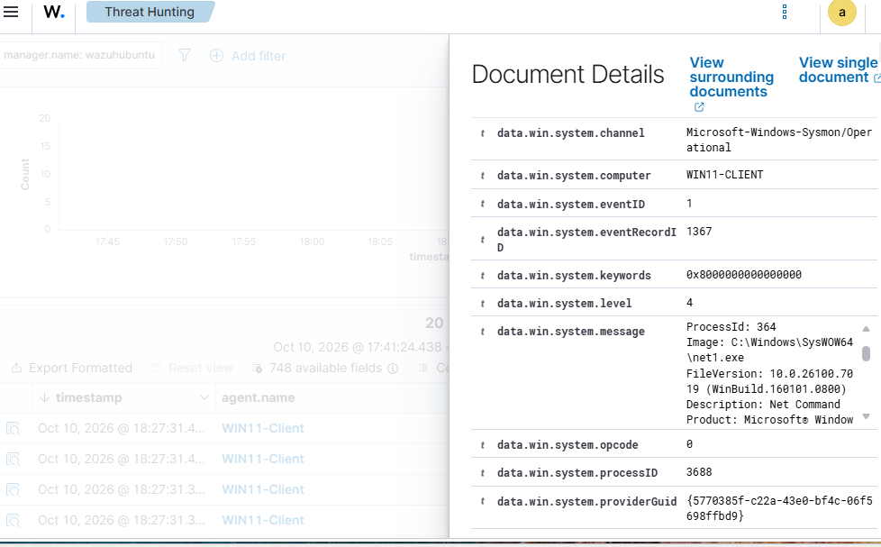

# Sysmon Installation and Wazuh Integration

## Overview

Microsoft Sysmon (System Monitor) was installed on the Windows 11 VM to provide detailed endpoint telemetry for the Enterprise SOC Lab.

Sysmon records system activity such as process creation and, when enabled through its configuration, network connections and other security-relevant events.

The objective was to integrate Sysmon with the existing Wazuh agent so that endpoint activity could be collected and analyzed centrally through the Wazuh SIEM.

This integration supports future SOC investigations involving controlled attack simulations originating from Kali Linux.

## Lab Environment

- **Endpoint:** Windows 11 Pro VM
- **Hypervisor:** VMware Workstation 17 Player
- **Monitoring Tool:** Microsoft Sysmon
- **SIEM:** Wazuh
- **Wazuh Agent:** 4.14.8
- **Agent Name:** WIN11-Client
- **Agent ID:** 001
- **Wazuh Server:** Ubuntu Server 22.04 LTS
- **Network:** VMware NAT

## Sysmon Installation

### Step 1: Download Sysmon

Open PowerShell as Administrator inside the Windows 11 VM.

Download Sysmon from Microsoft's official Sysinternals repository:

```powershell
Invoke-WebRequest -Uri "https://download.sysinternals.com/files/Sysmon.zip" -OutFile "$env:TEMP\Sysmon.zip"
```

### Step 2: Extract the Files

Extract the downloaded archive into a dedicated directory:

```powershell
Expand-Archive -Path "$env:TEMP\Sysmon.zip" -DestinationPath "C:\Sysmon" -Force
```

### Step 3: Install Sysmon

Navigate to the extracted directory:

```powershell
cd C:\Sysmon
```

Install Sysmon using its default configuration:

```powershell
.\Sysmon64.exe -accepteula -i
```

The `-accepteula` parameter accepts the license agreement, while `-i` initiates installation.

The navigation and installation commands were executed separately in PowerShell.

### Step 4: Verify Sysmon

Verify that Sysmon is installed and running:

```powershell
Get-Service *sysmon*
```

Confirm that Sysmon is generating Windows events:

```powershell
Get-WinEvent -LogName "Microsoft-Windows-Sysmon/Operational" -MaxEvents 5 |
Select-Object TimeCreated, Id, ProviderName
```

The Sysmon event channel was successfully accessed, and events were observed.

## Wazuh Integration

### Step 1: Open the Wazuh Agent Configuration

Open Notepad as Administrator on the Windows 11 VM.

Navigate to the Wazuh agent configuration file:

```text
C:\Program Files (x86)\ossec-agent\ossec.conf
```

When opening the file through Notepad, select **All Files** rather than **Text Documents** if the configuration file is not visible.

### Step 2: Enable Sysmon Event Collection

Within an existing `<ossec_config>` section, add the following configuration before its closing tag:

```xml
<localfile>
  <location>Microsoft-Windows-Sysmon/Operational</location>
  <log_format>eventchannel</log_format>
</localfile>
```

This configures the Wazuh agent to collect events from the Sysmon Operational event channel.

The existing Wazuh configuration was preserved.

### Step 3: Restart the Wazuh Agent

After saving `ossec.conf`, restart the Wazuh agent using Administrator PowerShell:

```powershell
Restart-Service WazuhSvc
```

Verify the service status:

```powershell
Get-Service WazuhSvc
```

The Wazuh agent was confirmed to be running after the configuration change.

## Event Verification

### Step 1: Generate Test Activity

A harmless process-creation test was initiated on the Windows 11 VM:

```powershell
Start-Process notepad.exe
```

This was intended to generate a Sysmon process-creation event.

### Step 2: Investigate Events in Wazuh

Open the Wazuh dashboard and navigate to:

**Threat Hunting → Events**

Inspect recent events associated with the Windows endpoint.

Expand an event and examine the event source, Windows event ID, and process information.

### Step 3: Confirm Sysmon Event Collection

The Wazuh dashboard displayed events with the following properties:

- **Agent:** WIN11-Client
- **Agent ID:** 001
- **Event Channel:** Microsoft-Windows-Sysmon/Operational
- **Event ID:** 1
- **Event Type:** Process Creation

The event details also contained process metadata, including executable paths, command lines, timestamps, and user information.

This confirms that Wazuh successfully received and processed Sysmon process-creation telemetry from the Windows 11 VM.

### Evidence — Sysmon Event in Wazuh

The screenshot below shows a Sysmon Event ID 1 recorded in the Wazuh dashboard.



### Notepad Test Visibility

Although the Notepad process was executed during testing, its specific process-creation event was not identified in Wazuh Threat Hunting.

This does not invalidate the integration because other Sysmon Event ID 1 records were successfully observed.

The investigation demonstrated an important distinction between endpoint event collection and alert visibility in the SIEM.

Wazuh's Threat Hunting interface primarily displays events that have triggered detection rules. Not every collected Sysmon event necessarily appears as an alert.

## Detection Capabilities

Sysmon provides additional telemetry that can support investigations of:

- Suspicious process execution
- Command-line activity
- Parent-child process relationships
- Network connections, when configured
- File creation and modification activity, depending on the configuration
- Potentially malicious PowerShell or command-line behavior

Event availability depends on the active Sysmon configuration and Wazuh collection and detection rules.

The current deployment uses Sysmon's initial configuration. Additional tuning may be required for broader detection coverage.

## Security Considerations

- Sysmon events provide telemetry but do not automatically indicate malicious activity.
- Process creation alone does not establish that an attack succeeded.
- Wazuh alerts must be evaluated in context to distinguish legitimate activity from suspicious behavior.
- Test activity is conducted within an authorized virtual lab environment.
- Detection findings should be supported by observed logs rather than assumptions.

## Results

| Verification | Result |
|---|---|
| Sysmon installation | Successful |
| Sysmon event generation | Confirmed |
| Wazuh agent running | Confirmed |
| Sysmon event channel configured in Wazuh | Completed |
| Sysmon Event ID 1 in Wazuh | Confirmed |
| Specific Notepad event identified in Wazuh | Not confirmed |
| Attack simulation detection | Pending |

## Next Steps

1. Review and tune Sysmon configuration for additional security telemetry.
2. Repeat the controlled phishing simulation from Kali Linux against the Windows 11 VM.
3. Record the attack timeline and relevant system activity.
4. Examine Wazuh alerts and Sysmon events for evidence of the simulation.
5. Identify detection successes and visibility gaps.
6. Produce a professional SOC incident investigation report based on the collected evidence.
