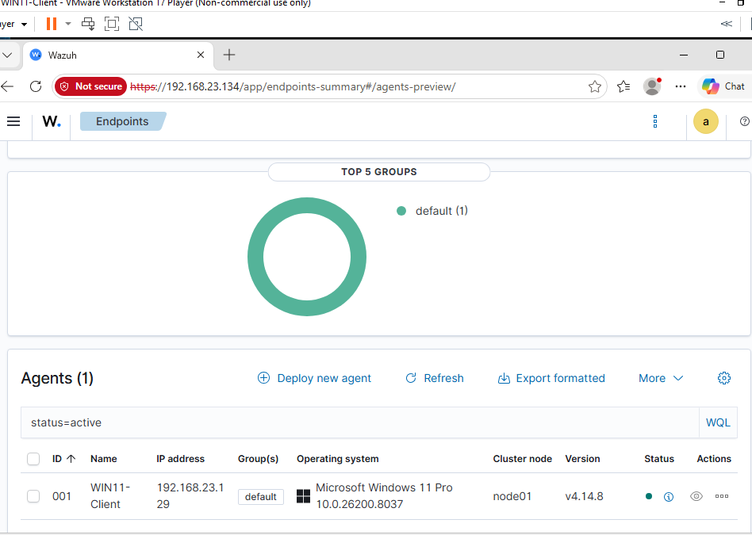

# Wazuh Agent Deployment — Windows 11

## Overview

The Wazuh agent was deployed on the Windows 11 Pro victim VM to enable centralized endpoint monitoring through the Ubuntu-hosted Wazuh SIEM.

The agent collects endpoint security telemetry to support threat detection, incident investigation, and analysis of controlled attacks originating from the Kali Linux VM.

## Deployment Configuration

- **Operating System:** Windows 11 Pro
- **Agent Version:** 4.14.8
- **Agent Architecture:** x86_64
- **Wazuh Manager:** Ubuntu Server 22.04 LTS
- **Wazuh Manager IP:** 192.168.23.134
- **Agent Name:** WIN11-Client
- **Agent ID:** 001
- **Agent Group:** default
- **Network:** VMware NAT

**Note:** The IP address `192.168.23.134` belongs to the Ubuntu server hosting Wazuh in this specific lab. Anyone reproducing this deployment must substitute the IP address of their own Wazuh Manager.

## Installation Procedure

### Step 1: Generate the Installation Command

1. Open the Wazuh dashboard.
2. Navigate to **Endpoints → Deploy new agent**.
3. Select **Windows** as the operating system.
4. Select **x86_64** as the architecture.
5. Enter the IP address of the Ubuntu server hosting the Wazuh Manager (in this lab: `192.168.23.134`).
6. Set the agent name to `WIN11-Client`, or choose another unique name for the endpoint.
7. Select the `default` agent group.
8. Copy the PowerShell installation command generated by the dashboard.

The Wazuh Manager IP must correspond to the address of the reader's own Ubuntu/Wazuh server. The Windows endpoint must be able to communicate with that server over the network.

### Step 2: Install the Windows Agent

Open **PowerShell as Administrator** inside the Windows 11 VM.

Copy the installation command generated by the Wazuh dashboard.

In Windows PowerShell, right-clicking inside the terminal window pastes the copied command. Press Enter to execute it.

The command downloads the official Wazuh Windows agent MSI and installs the agent with the configured manager address, agent name, and group.

The installation uses the following general process:

1. Download the Wazuh Windows agent installer.
2. Install the agent using Windows Installer (`msiexec.exe`).
3. Configure the agent to communicate with the specified Wazuh Manager.

**Important:** Use the command generated by your own Wazuh dashboard, since the manager IP address and agent configuration depend on your environment.

### Step 3: Start the Agent

After installation, run the following command in Administrator PowerShell:

```powershell
NET START Wazuh
```

The terminal confirmed that the agent service started successfully:

```text
The Wazuh service is starting.
The Wazuh service was started successfully.
```

### Step 4: Verify Agent Connectivity

Return to the Wazuh dashboard and navigate to **Endpoints**.

Confirm that the Windows agent appears in the agent inventory and reports an **Active** status.

The deployed agent was successfully registered with the following details:

- **Agent Name:** WIN11-Client
- **Agent ID:** 001
- **Operating System:** Windows 11 Pro
- **Agent Version:** 4.14.8
- **Agent Group:** default
- **Status:** Active

## Agent Verification

The following screenshot confirms successful registration and communication between the Windows 11 VM and the Ubuntu-hosted Wazuh Manager.



## Troubleshooting

### DNS Resolution Failure During Installation

**Issue:**

The initial installation attempt failed because the Windows 11 VM could not resolve the Wazuh package repository domain (`packages.wazuh.com`).

The PowerShell installation command returned an error indicating that the remote hostname could not be resolved.

**Investigation:**

Several diagnostic steps were performed:

1. Verified the Windows VM's network configuration using `ipconfig /all`.
2. Confirmed that the Windows VM was connected to the VMware NAT network.
3. Verified outbound HTTPS connectivity using:

```powershell
Test-NetConnection 1.1.1.1 -Port 443
```

The connection succeeded, confirming that outbound TCP connectivity was available.

4. Tested DNS resolution using:

```powershell
Resolve-DnsName packages.wazuh.com
```

The request timed out.

5. Attempted a direct query to Cloudflare's DNS server:

```powershell
Resolve-DnsName packages.wazuh.com -Server 1.1.1.1
```

This request also timed out.

6. Investigated the Windows host's DNS configuration and identified an active ExpressVPN virtual network adapter.

**Resolution:**

After exiting the VPN applications on the Windows host, DNS resolution succeeded inside the Windows 11 VM.

The Wazuh installation command was executed again, and the agent service started successfully.

This suggests VPN-related interference with DNS resolution, although the exact underlying mechanism was not confirmed.

### Agent Service Not Found

**Issue:**

After the initial installation attempt, Windows could not locate the expected Wazuh agent service.

Attempts to start the service failed because Windows reported that the service could not be found.

**Resolution:**

The installation command generated by the Wazuh dashboard was executed again after DNS connectivity had been restored.

The agent was then successfully started using:

```powershell
NET START Wazuh
```

The Wazuh dashboard subsequently confirmed that `WIN11-Client` was registered and Active.

The exact cause of the incomplete initial installation was not determined.

## Next Steps

1. Install Microsoft Sysmon on the Windows 11 VM.
2. Configure Sysmon to collect detailed Windows security events.
3. Configure the Wazuh agent to forward Sysmon event logs.
4. Verify that endpoint security events appear in the Wazuh dashboard.
5. Repeat the controlled attack simulation from Kali Linux.
6. Investigate the resulting security telemetry and alerts.
7. Document detection findings and create a SOC incident report.

