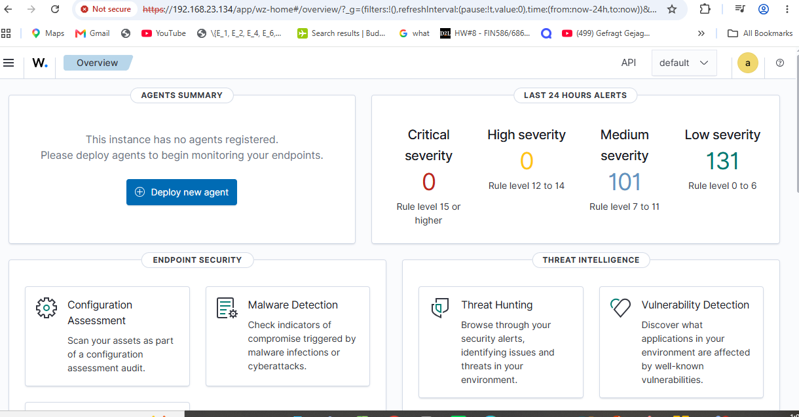

# Wazuh Server Deployment

## Overview

Wazuh SIEM was deployed on Ubuntu Server 22.04 LTS to provide centralized log collection, security monitoring, threat detection, and incident analysis for the Enterprise SOC Lab.

The server acts as the central monitoring platform, collecting and analyzing security events generated during simulated attacks against the Windows 11 victim VM.

## Server Configuration

- **OS:** Ubuntu Server 22.04 LTS
- **Hypervisor:** VMware Workstation 17 Player
- **RAM:** 6 GB
- **CPU:** 4 virtual CPUs
- **Storage:** 100 GB
- **Network:** VMware NAT (192.168.x.x/24)

## Wazuh Components Installed

- **Wazuh Manager:** Collects and analyzes security events from monitored endpoints.
- **Wazuh Indexer:** Stores and indexes security event data.
- **Wazuh Dashboard:** Provides a web interface for monitoring alerts and investigating security activity.
- **Wazuh API:** Enables communication with and management of Wazuh components.
- **Filebeat:** Forwards security alerts from the manager to the indexer.

## Installation Method

Wazuh was installed using the official all-in-one installation assistant, which deploys the manager, indexer, and dashboard on a single Ubuntu server.

### Step 1: Download the Installation Script

```bash
curl -fLO https://packages.wazuh.com/4.14/wazuh-install.sh
```

### Step 2: Run the Installation

```bash
sudo bash ./wazuh-install.sh -a
```

The `-a` flag enables an all-in-one installation of the Wazuh components.

### Step 3: Verify Installation

After installation, the installer confirmed that the following services started successfully:

- Wazuh Manager
- Wazuh Indexer
- Wazuh Dashboard
- Filebeat

Service status can also be verified using:

```bash
sudo systemctl is-active wazuh-manager wazuh-indexer wazuh-dashboard filebeat
```

## Dashboard Access

The Wazuh dashboard was successfully accessed from the Windows host through a web browser using the Ubuntu server's private IP address.

```text
https://<WAZUH_SERVER_IP>
```

The `admin` account is used for initial authentication. Login credentials are stored privately and are not included in this repository.

### Wazuh Dashboard Screenshot

The following screenshot documents access to the Wazuh dashboard from the Windows host.



## Network Configuration

The Ubuntu server uses VMware NAT networking, allowing communication between the virtual machines and the Windows host.

- **Network Type:** NAT
- **Subnet:** 192.168.x.x/24
- **Server Role:** Centralized security monitoring
- **Dashboard Access:** HTTPS (port 443)
- **Agent Communication:** TCP port 1514
- **Agent Enrollment:** TCP port 1515

The Wazuh server is intended to collect security telemetry from the Windows 11 endpoint and support the analysis of simulated attacks originating from Kali Linux.

## Security Considerations

- Administrator credentials are excluded from the public repository.
- The dashboard uses HTTPS with a self-signed certificate.
- Private lab addresses are used for communication between virtual machines.
- Attack simulations are performed in a controlled virtual environment.
- Wazuh agents will be configured to forward endpoint security telemetry to the server.

## Next Steps

1. Deploy the Wazuh agent on the Windows 11 VM.
2. Install and configure Sysmon for detailed Windows event monitoring.
3. Configure Wazuh to collect Sysmon events.
4. Verify endpoint connectivity and event ingestion.
5. Execute controlled attack simulations from Kali Linux.
6. Analyze generated alerts and document the detection and incident response process.

